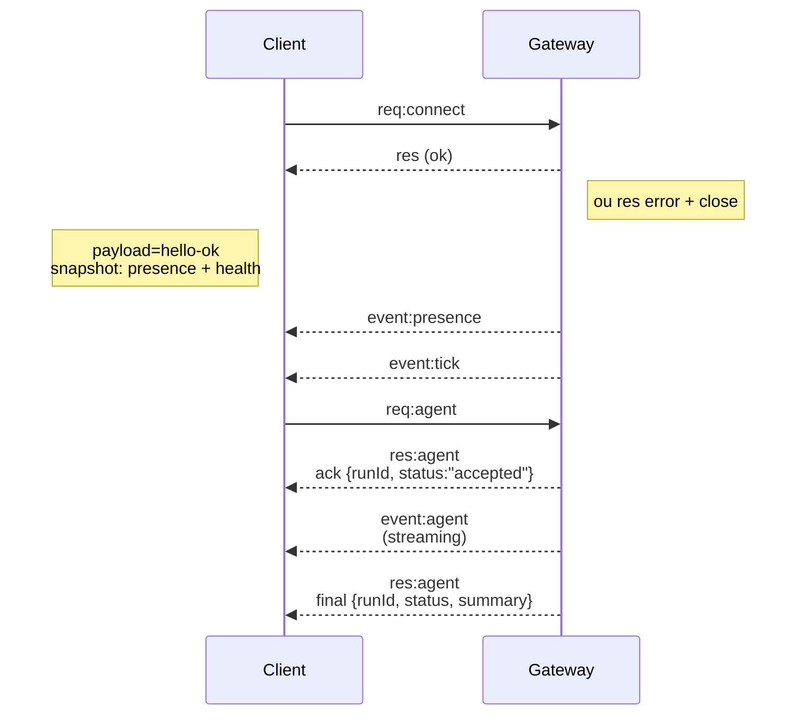

# Architecture de la passerelle

Dernière mise à jour : 22 janvier 2026

## Vue d'ensemble

- Une seule **Passerelle** persistante contrôle toutes les surfaces de messagerie (WhatsApp via
  Baileys, Telegram via grammY, Slack, Discord, Signal, iMessage, WebChat).
- Les clients du plan de contrôle (app macOS, CLI, interface web, automations) se connectent à la
  Passerelle via **WebSocket** sur l'hôte de liaison configuré (par défaut
  `127.0.0.1:18789`).
- Les **Nœuds** (macOS/iOS/Android/headless) se connectent aussi via **WebSocket**, mais
  déclarent `role: node` avec des capacités/commandes explicites.
- Une Passerelle par hôte ; c'est le seul endroit qui ouvre une session WhatsApp.
- L'**hôte canvas** est servi par le serveur HTTP de la Passerelle sous :
  - `/__openclaw__/canvas/` (HTML/CSS/JS éditable par l'agent)
  - `/__openclaw__/a2ui/` (hôte A2UI)
    Il utilise le même port que la Passerelle (par défaut `18789`).

## Composants et flux

### Passerelle (démon)

- Maintient les connexions aux fournisseurs.
- Expose une API WS typée (requêtes, réponses, événements push serveur).
- Valide les trames entrantes contre un schéma JSON.
- Émet des événements comme `agent`, `chat`, `presence`, `health`, `heartbeat`, `cron`.

### Clients (app mac / CLI / admin web)

- Une connexion WS par client.
- Envoient des requêtes (`health`, `status`, `send`, `agent`, `system-presence`).
- S'abonnent aux événements (`tick`, `agent`, `presence`, `shutdown`).

### Nœuds (macOS / iOS / Android / headless)

- Se connectent au **même serveur WS** avec `role: node`.
- Fournissent une identité d'appareil dans `connect` ; l'appairage est **basé sur l'appareil** (rôle `node`) et
  l'approbation vit dans le magasin d'appairage d'appareils.
- Exposent des commandes comme `canvas.*`, `camera.*`, `screen.record`, `location.get`.

Détails du protocole :

- [Protocole de passerelle](/fr-FR/gateway/protocol)

### WebChat

- Interface statique qui utilise l'API WS de la Passerelle pour l'historique de chat et les envois.
- Dans les configurations distantes, se connecte via le même tunnel SSH/Tailscale que les autres
  clients.

## Cycle de vie de connexion (client unique)



## Protocole sur le réseau (résumé)

- Transport : WebSocket, trames texte avec charges JSON.
- La première trame **doit** être `connect`.
- Après la poignée de main :
  - Requêtes : `{type:"req", id, method, params}` → `{type:"res", id, ok, payload|error}`
  - Événements : `{type:"event", event, payload, seq?, stateVersion?}`
- Si `OPENCLAW_GATEWAY_TOKEN` (ou `--token`) est défini, `connect.params.auth.token`
  doit correspondre ou le socket se ferme.
- Les clés d'idempotence sont requises pour les méthodes avec effets de bord (`send`, `agent`) pour
  réessayer en toute sécurité ; le serveur conserve un cache de déduplication de courte durée.
- Les nœuds doivent inclure `role: "node"` plus caps/commands/permissions dans `connect`.

## Appairage + confiance locale

- Tous les clients WS (opérateurs + nœuds) incluent une **identité d'appareil** sur `connect`.
- Les nouveaux ID d'appareil nécessitent une approbation d'appairage ; la Passerelle émet un **token d'appareil**
  pour les connexions suivantes.
- Les connexions **locales** (loopback ou l'adresse tailnet propre de l'hôte de passerelle) peuvent être
  auto-approuvées pour garder l'UX du même hôte fluide.
- Les connexions **non-locales** doivent signer le nonce `connect.challenge` et nécessitent
  une approbation explicite.
- L'authentification de passerelle (`gateway.auth.*`) s'applique toujours à **toutes** les connexions, locales ou
  distantes.

Détails : [Protocole de passerelle](/fr-FR/gateway/protocol), [Appairage](/fr-FR/channels/pairing),
[Sécurité](/fr-FR/gateway/security).

## Typage du protocole et génération de code

- Les schémas TypeBox définissent le protocole.
- Le schéma JSON est généré à partir de ces schémas.
- Les modèles Swift sont générés à partir du schéma JSON.

## Accès distant

- Préféré : Tailscale ou VPN.
- Alternative : tunnel SSH

  ```bash
  ssh -N -L 18789:127.0.0.1:18789 user@host
  ```

- La même poignée de main + token d'authentification s'appliquent sur le tunnel.
- TLS + épinglage optionnel peuvent être activés pour WS dans les configurations distantes.

## Instantané des opérations

- Démarrage : `openclaw gateway` (premier plan, journaux vers stdout).
- Santé : `health` via WS (aussi inclus dans `hello-ok`).
- Supervision : launchd/systemd pour redémarrage automatique.

## Invariants

- Exactement une Passerelle contrôle une seule session Baileys par hôte.
- La poignée de main est obligatoire ; toute première trame non-JSON ou non-connect est une fermeture brutale.
- Les événements ne sont pas rejoués ; les clients doivent se rafraîchir en cas de lacunes.
