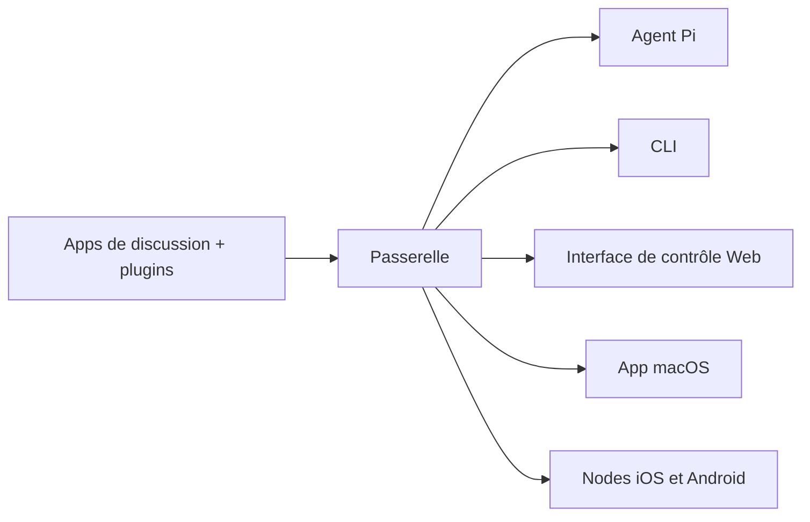

# OpenClaw 🦞

<p align="center">
    
    
</p>

> _« EXFOLIEZ ! EXFOLIEZ ! »_ — Un homard spatial, probablement

<p align="center">
  <strong>Passerelle tous OS pour agents IA sur WhatsApp, Telegram, Discord, iMessage et plus.</strong><br />
  Envoyez un message, obtenez une réponse d'agent depuis votre poche. Les plugins ajoutent Mattermost et plus encore.
</p>

<Columns>
  <Card title="Démarrer" href="/start/getting-started" icon="rocket">
    Installez OpenClaw et lancez la Passerelle en quelques minutes.
  </Card>
  <Card title="Lancer l'assistant" href="/start/wizard" icon="sparkles">
    Configuration guidée avec `openclaw onboard` et flux d'appairage.
  </Card>
  <Card title="Ouvrir l'Interface de contrôle" href="/web/control-ui" icon="layout-dashboard">
    Lancez le tableau de bord du navigateur pour la discussion, la config et les sessions.
  </Card>
</Columns>

## Qu'est-ce qu'OpenClaw ?

OpenClaw est une **passerelle auto-hébergée** qui connecte vos applications de discussion préférées — WhatsApp, Telegram, Discord, iMessage et plus — à des agents IA de codage comme Pi. Vous exécutez un seul processus de Passerelle sur votre propre machine (ou un serveur), et il devient le pont entre vos applications de messagerie et un assistant IA toujours disponible.

**Pour qui est-ce ?** Les développeurs et utilisateurs avancés qui veulent un assistant IA personnel qu'ils peuvent contacter de n'importe où — sans abandonner le contrôle de leurs données ni dépendre d'un service hébergé.

**Qu'est-ce qui le rend différent ?**

- **Auto-hébergé** : fonctionne sur votre matériel, vos règles
- **Multi-canaux** : une Passerelle dessert WhatsApp, Telegram, Discord et plus simultanément
- **Natif pour les agents** : conçu pour les agents de codage avec utilisation d'outils, sessions, mémoire et routage multi-agents
- **Open source** : licence MIT, piloté par la communauté

**De quoi avez-vous besoin ?** Node 22+, une clé API (Anthropic recommandé) et 5 minutes.

## Comment ça marche



La Passerelle est la source unique de vérité pour les sessions, le routage et les connexions de canaux.

## Capacités clés

<Columns>
  <Card title="Passerelle multi-canaux" icon="network">
    WhatsApp, Telegram, Discord et iMessage avec un seul processus de Passerelle.
  </Card>
  <Card title="Canaux de plugins" icon="plug">
    Ajoutez Mattermost et plus avec des paquets d'extension.
  </Card>
  <Card title="Routage multi-agents" icon="route">
    Sessions isolées par agent, espace de travail ou expéditeur.
  </Card>
  <Card title="Support média" icon="image">
    Envoyez et recevez des images, audio et documents.
  </Card>
  <Card title="Interface de contrôle Web" icon="monitor">
    Tableau de bord du navigateur pour la discussion, la config, les sessions et les nodes.
  </Card>
  <Card title="Nodes mobiles" icon="smartphone">
    Appairez des nodes iOS et Android avec support Canvas.
  </Card>
</Columns>

## Démarrage rapide

<Steps>
  <Step title="Installer OpenClaw">
    ```bash
    npm install -g openclaw@latest
    ```
  </Step>
  <Step title="Configurer et installer le service">
    ```bash
    openclaw onboard --install-daemon
    ```
  </Step>
  <Step title="Appairer WhatsApp et démarrer la Passerelle">
    ```bash
    openclaw channels login
    openclaw gateway --port 18789
    ```
  </Step>
</Steps>

Besoin de l'installation complète et de la configuration de développement ? Voir [Démarrage rapide](/start/quickstart).

## Tableau de bord

Ouvrez l'Interface de contrôle du navigateur après le démarrage de la Passerelle.

- Par défaut local : [http://127.0.0.1:18789/](http://127.0.0.1:18789/)
- Accès distant : [Surfaces web](/web) et [Tailscale](/gateway/tailscale)

<p align="center">
  
</p>

## Configuration (optionnel)

La config se trouve à `~/.openclaw/openclaw.json`.

- Si vous **ne faites rien**, OpenClaw utilise le binaire Pi intégré en mode RPC avec des sessions par expéditeur.
- Si vous voulez le verrouiller, commencez par `channels.whatsapp.allowFrom` et (pour les groupes) les règles de mention.

Exemple :

```json5
{
  channels: {
    whatsapp: {
      allowFrom: ["+15555550123"],
      groups: { "*": { requireMention: true } },
    },
  },
  messages: { groupChat: { mentionPatterns: ["@openclaw"] } },
}
```

## Commencer ici

<Columns>
  <Card title="Hubs de docs" href="/start/hubs" icon="book-open">
    Toutes les docs et guides, organisés par cas d'usage.
  </Card>
  <Card title="Configuration" href="/gateway/configuration" icon="settings">
    Paramètres de Passerelle principaux, tokens et config de fournisseur.
  </Card>
  <Card title="Accès distant" href="/gateway/remote" icon="globe">
    Modèles d'accès SSH et tailnet.
  </Card>
  <Card title="Canaux" href="/channels/telegram" icon="message-square">
    Configuration spécifique aux canaux pour WhatsApp, Telegram, Discord et plus.
  </Card>
  <Card title="Nodes" href="/nodes" icon="smartphone">
    Nodes iOS et Android avec appairage et Canvas.
  </Card>
  <Card title="Aide" href="/help" icon="life-buoy">
    Corrections courantes et point d'entrée du dépannage.
  </Card>
</Columns>

## En savoir plus

<Columns>
  <Card title="Liste complète des fonctionnalités" href="/concepts/features" icon="list">
    Capacités complètes des canaux, du routage et des médias.
  </Card>
  <Card title="Routage multi-agents" href="/concepts/multi-agent" icon="route">
    Isolation de l'espace de travail et sessions par agent.
  </Card>
  <Card title="Sécurité" href="/gateway/security" icon="shield">
    Tokens, listes blanches et contrôles de sécurité.
  </Card>
  <Card title="Dépannage" href="/gateway/troubleshooting" icon="wrench">
    Diagnostics de Passerelle et erreurs courantes.
  </Card>
  <Card title="À propos et crédits" href="/reference/credits" icon="info">
    Origines du projet, contributeurs et licence.
  </Card>
</Columns>
